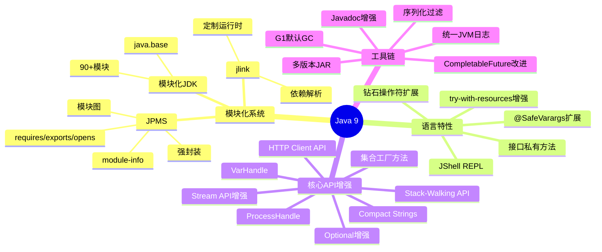
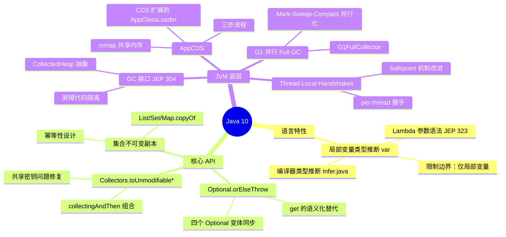

# Java 新特性
## Java 9 知识地图

### 概念图谱

```mermaid
mindmap
  root((Java 9))
    模块化系统
      JPMS
        module-info
        requires/exports/opens
        强封装
        模块图
      模块化JDK
        java.base
        90+模块
      jlink
        定制运行时
        依赖解析
    语言特性
      JShell REPL
      接口私有方法
      try-with-resources增强
      钻石操作符扩展
      @SafeVarargs扩展
    核心API增强
      集合工厂方法
      Stream API增强
      Optional增强
      HTTP Client API
      Compact Strings
      ProcessHandle
      Stack-Walking API
      VarHandle
    工具链
      G1默认GC
      多版本JAR
      统一JVM日志
      序列化过滤
      Javadoc增强
      CompletableFuture改进
```

## Java 10 知识地图

### 概念图谱

```mermaid
mindmap
  root((Java 10))
    语言特性
      局部变量类型推断 var
        编译器类型推断 Infer.java
        限制边界：仅局部变量
        Lambda 参数语法 JEP 323
    核心 API
      集合不可变副本
        List/Set/Map.copyOf
        幂等性设计
      Collectors.toUnmodifiable*
        collectingAndThen 组合
        共享密钥问题修复
      Optional.orElseThrow
        get 的语义化替代
        四个 Optional 变体同步
    JVM 底层
      AppCDS
        CDS 扩展到 AppClassLoader
        三步流程
        mmap 共享内存
      G1 并行 Full GC
        G1FullCollector
        Mark-Sweep-Compact 并行化
      GC 接口 JEP 304
        CollectedHeap 抽象
        屏障代码隔离
      Thread-Local Handshakes
        Safepoint 机制改进
        per-thread 握手
```        