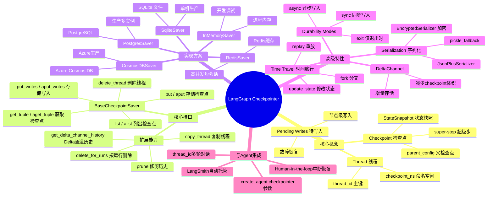

# LangGraph Checkpointer 知识地图

## 概念图谱

## 分支优先级

| 分支 | 优先级 | 说明 |
|------|--------|------|
| Thread + Checkpoint 核心概念 | 🔴 必须深钻 | 理解持久化的基础 |
| super-step 边界 | 🔴 必须深钻 | 决定何时保存检查点 |
| BaseCheckpointSaver 五方法 | 🔴 必须深钻 | 自定义实现的接口契约 |
| InMemorySaver | 🔴 必须深钻 | 最简单实现，理解存储结构 |
| PostgresSaver | 🔴 必须深钻 | 生产环境最常用 |
| SqliteSaver | 🟡 建议掌握 | 单机/本地开发常用 |
| Durability Modes | 🟡 建议掌握 | 性能与一致性的权衡 |
| Serialization + Encryption | 🟡 建议掌握 | 生产安全要求 |
| DeltaChannel | 🟢 了解即可 | Beta特性，减少存储 |
| Time Travel | 🟢 了解即可 | 调试/分叉场景 |
| CosmosDB / Redis | 🟢 了解即可 | 特定云/场景 |

## 交叉关联

- Checkpoint 的 super-step 边界与 LangGraph Pregel 执行模型直接相关
- thread_id 是 create_agent 多轮对话记忆的基础
- Pending Writes 是故障容错的核心机制
- DeltaChannel 依赖 get_delta_channel_history 的正确实现
- PostgresSaver 是 LangSmith Deployment 的默认 checkpointer

## 学习路径

建议顺序：
1. Thread + Checkpoint 核心概念 → super-step 边界
2. StateSnapshot 字段详解 → get_state / get_state_history
3. BaseCheckpointSaver 五方法接口契约
4. InMemorySaver 实现（理解存储结构）
5. SqliteSaver → PostgresSaver（生产升级路径）
6. Durability Modes → Serialization → Encryption
7. Time Travel → DeltaChannel（选读）
8. 与 create_agent 集成
